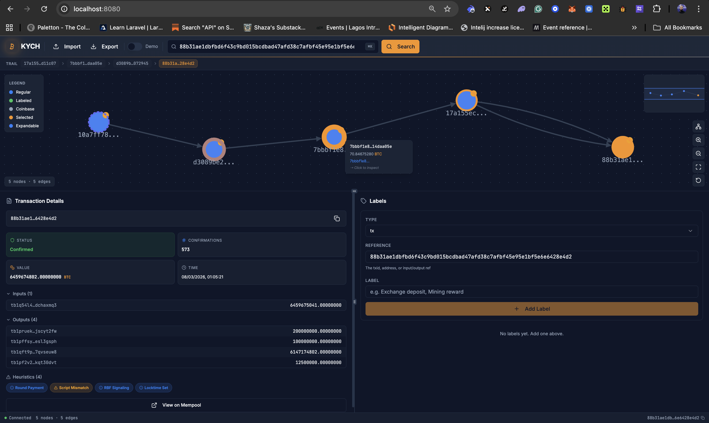
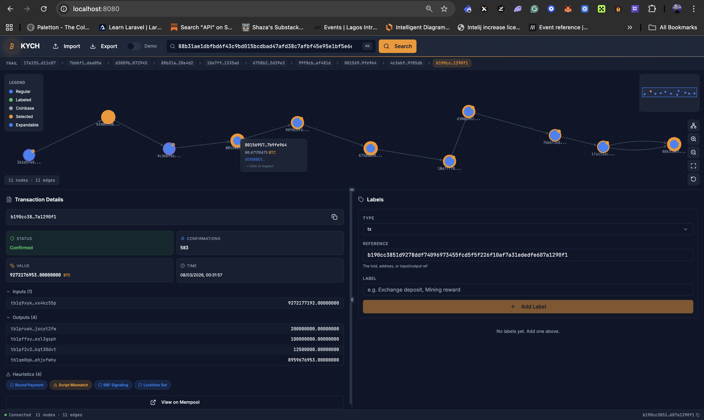

# ₿ KYCH — Know Your Coin History

A privacy-first Bitcoin transaction ancestry explorer. Trace the provenance of any UTXO through an interactive graph, attach [BIP-329](https://github.com/bitcoin/bips/blob/master/bip-0329.mediawiki) labels, and keep everything local — powered by your own Bitcoin Core node.

> Built for the [BOSS 2026 Challenge](https://bosschallenge.xyz/) — Month 2 Portfolio Project.


---

## Screenshots

**Transaction inspection** — click any node to inspect, hover for tooltip with BTC value.  
Heuristic badges (Round Payment, Script Mismatch, RBF Signaling, Locktime Set) shown below.



**Progressive exploration** — double-click expandable nodes to walk deeper into the ancestry.  
11 nodes explored across the graph with full breadcrumb trail.



---

## Features

- **Click-to-Expand Graph** — Starts at depth 1; double-click any node to progressively explore backwards through ancestors without cluttering the UI
- **8 Wallet Fingerprinting Heuristics** — Round payment, address reuse, change output detection, consolidation, script type mismatch, RBF signaling, locktime analysis, and unnecessary input heuristic (UIOH)
- **Interactive Graph Visualization** — Cytoscape.js‑powered directed acyclic graph with dagre layout, zoom controls, minimap, and address clustering
- **BIP-329 Label Management** — Create, edit, import, and export labels in the wallet-standard JSON Lines format
- **Dual Backend Support** — Use Bitcoin Core RPC or Electrum server as interchangeable backends
- **Privacy-First Architecture** — All data comes from your local node; zero third-party API calls
- **Breadcrumb Trail** — Track your full exploration path across the graph
- **Node Tooltips** — Hover any node to see txid, value, and expansion hints
- **Demo Mode** — Explore the UI with built-in sample data, no node required
- **Command Palette** — `⌘K` quick-search for any transaction by ID

---

## Architecture

```
┌─────────────────────────────┐      JSON/REST       ┌─────────────────────────────┐
│         Frontend            │ ◄──────────────────► │          Backend            │
│  React · TypeScript · Vite  │    localhost:8000     │   FastAPI · Python 3.11+    │
│  Tailwind · shadcn/ui       │                       │   NetworkX · httpx          │
│  Cytoscape.js · Framer      │                       │   BIP-329 · 8 Heuristics    │
└─────────────────────────────┘                       └──────────┬──────────────────┘
                                                                 │ JSON-RPC
                                                      ┌──────────▼──────────────────┐
                                                      │  Bitcoin Core  OR  Electrum │
                                                      │  signet / mainnet / testnet │
                                                      │  txindex=1  ·  RPC enabled  │
                                                      └─────────────────────────────┘
```

---

## Prerequisites

| Dependency | Version | Notes |
|---|---|---|
| **Docker** | 20+ | For the one-command setup |
| **Bitcoin Core** | 25.0+ | `txindex=1` and RPC enabled |
| **Python** | 3.11+ | For manual setup only |
| **Node.js** | 18+ | For manual setup only |
| **npm** | 9+ | For manual setup only |

---

## Quick Start

### Docker (recommended)

The fastest way to get running — only requires Docker and a Bitcoin Core node:

```bash
git clone git@github.com:emmanuelist/kych-explorer.git
cd kych-explorer

# Configure your Bitcoin Core RPC credentials
cp backend/.env.example backend/.env
# Edit backend/.env with your RPC host/user/password

docker compose up --build
```

Open `http://localhost` in your browser. The API is at `http://localhost:8000/docs`.

> **Note:** The backend connects to Bitcoin Core on your host machine via `host.docker.internal`.
> If your node runs on a different host, set `BITCOIN_RPC_HOST` in `backend/.env` or pass it directly:
>
> ```bash
> BITCOIN_RPC_HOST=192.168.1.50 BITCOIN_RPC_PORT=38332 docker compose up --build
> ```

### Manual Setup

#### 1. Clone

```bash
git clone git@github.com:emmanuelist/kych-explorer.git
cd kych-explorer
```

#### 2. Backend

```bash
cd backend
python3 -m venv venv
source venv/bin/activate
pip install -r requirements.txt

# Configure your Bitcoin Core RPC credentials
cp .env.example .env
# Edit .env with your values

# Start the API server
uvicorn app.main:app --reload --port 8000
```

The API is now running at `http://localhost:8000`. Interactive docs at `http://localhost:8000/docs`.

#### 3. Frontend

```bash
cd frontend
npm install

# Point at the backend
echo "VITE_API_BASE_URL=http://localhost:8000" > .env

# Start the dev server
npm run dev
```

Open `http://localhost:8080` in your browser.

---

## Bitcoin Core Configuration

Add the following to your `bitcoin.conf`:

```ini
# Enable RPC
server=1
rpcuser=your_username
rpcpassword=your_password

# Required for transaction lookups
txindex=1

# Network (pick one)
signet=1        # recommended for testing
# testnet=1
# (omit both for mainnet)
```

After changing `txindex`, a reindex is required:

```bash
bitcoind -reindex
```

---

## API Endpoints

| Method | Endpoint | Description |
|---|---|---|
| `GET` | `/api/health` | Health check |
| `GET` | `/api/transactions/{txid}` | Fetch parsed transaction |
| `GET` | `/api/graph/traverse/{txid}?depth=3` | Build ancestry graph |
| `GET` | `/api/graph/cytoscape/{txid}?depth=3` | Cytoscape.js-formatted graph |
| `GET` | `/api/graph/expand/{txid}` | Expand single node (click-to-expand) |
| `GET` | `/api/transactions/{txid}/heuristics` | Run 8 fingerprinting heuristics |
| `GET` | `/api/labels` | List all labels |
| `POST` | `/api/labels` | Create / update a label |
| `DELETE` | `/api/labels/{type}/{ref}` | Delete a label |
| `POST` | `/api/labels/import` | Import BIP-329 JSONL file |
| `GET` | `/api/labels/export` | Export labels as BIP-329 JSONL |

Full interactive documentation available at `/docs` (Swagger) or `/redoc`.

---

## Project Structure

```
kych-explorer/
├── backend/
│   ├── app/
│   │   ├── api/              # Route handlers
│   │   │   ├── graph.py      # Graph traversal + Cytoscape endpoints
│   │   │   ├── labels.py     # BIP-329 label CRUD + import/export
│   │   │   └── transactions.py
│   │   ├── models/
│   │   │   └── schemas.py    # Pydantic data models
│   │   ├── services/
│   │   │   ├── bitcoin_rpc.py      # Bitcoin Core JSON-RPC client
│   │   │   ├── electrum_client.py  # Electrum server protocol client
│   │   │   ├── graph_service.py    # BFS graph traversal + NetworkX
│   │   │   ├── heuristics.py       # 8 wallet fingerprinting heuristics
│   │   │   └── label_store.py      # JSONL file-based label persistence
│   │   ├── config.py         # Settings via pydantic-settings
│   │   └── main.py           # FastAPI entry point
│   ├── tests/
│   ├── .env.example
│   ├── Dockerfile
│   └── requirements.txt
├── frontend/
│   ├── public/
│   │   └── favicon.svg
│   ├── src/
│   │   ├── components/       # React components
│   │   │   ├── TransactionGraph.tsx   # Cytoscape graph + click-to-expand
│   │   │   ├── TransactionDetails.tsx # Tx details + heuristic badges
│   │   │   ├── GraphBreadcrumb.tsx    # Transaction trail breadcrumb
│   │   │   ├── GraphLegend.tsx
│   │   │   ├── GraphMinimap.tsx
│   │   │   └── ui/           # shadcn/ui primitives
│   │   ├── hooks/            # Custom React hooks
│   │   ├── lib/              # Utilities, mock data, API client
│   │   ├── pages/
│   │   │   └── Index.tsx     # Main page
│   │   └── types/            # TypeScript interfaces
│   ├── index.html
│   ├── tailwind.config.ts
│   ├── Dockerfile
│   ├── nginx.conf
│   └── vite.config.ts
├── docker-compose.yml
└── README.md
```

---

## Wallet Fingerprinting Heuristics

KYCH runs 8 heuristics on every transaction to surface privacy-relevant patterns:

| # | Heuristic | Description |
|---|-----------|-------------|
| 1 | **Round Payment** | Output value is a round BTC amount (e.g. 0.1, 1.0) |
| 2 | **Address Reuse** | An input address also appears in the outputs |
| 3 | **Change Output** | In a 2-output tx, the non-round output is likely change |
| 4 | **Consolidation** | Multiple inputs merged into a single output |
| 5 | **Script Mismatch** | Input and output address types differ (e.g. P2WPKH → P2TR) |
| 6 | **RBF Signaling** | At least one input has sequence < 0xFFFFFFFE |
| 7 | **Locktime Set** | nLockTime > 0, indicating anti-fee-sniping or timelocks |
| 8 | **Unnecessary Input (UIOH)** | A single input could cover all outputs; extra inputs likely same wallet |

---

## Tech Stack

**Frontend:** React 18 · TypeScript · Vite · Tailwind CSS · shadcn/ui · Cytoscape.js · Framer Motion · React Query · React Router v6

**Backend:** Python · FastAPI · Pydantic · httpx · NetworkX · BIP-329 JSONL · 8 Heuristics

**Infrastructure:** Bitcoin Core JSON-RPC or Electrum · Vercel (frontend) · Local node (backend)

---

## BIP-329 Label Format

KYCH uses the [BIP-329](https://github.com/bitcoin/bips/blob/master/bip-0329.mediawiki) standard for label interoperability. Labels are stored as JSON Lines:

```jsonl
{"type":"tx","ref":"bdbe5e534f...","label":"Mining reward"}
{"type":"addr","ref":"tb1qx5v6...","label":"Exchange deposit address"}
```

Import and export via the UI toolbar or the `/api/labels/import` and `/api/labels/export` endpoints.

---

## License

MIT

---

## Acknowledgments

- [Bitcoin Core](https://github.com/bitcoin/bitcoin)
- [BIP-329](https://github.com/bitcoin/bips/blob/master/bip-0329.mediawiki) — Wallet Labels
- [Cytoscape.js](https://js.cytoscape.org/)
- [BOSS 2026 Challenge](https://bosschallenge.xyz/)
